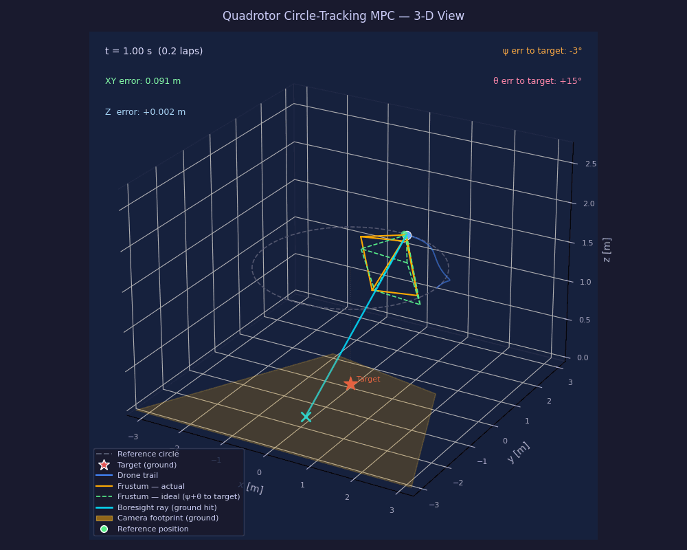

# Argus — Quadrotor Target-Tracking MPC

Model Predictive Control for a quadrotor tracking a circular trajectory with yaw locked toward an object at the centre. The controller is formulated as a Nonlinear MPC using [ACADOS](https://docs.acados.org/), which generates a C solver that is called from C++.



*Drone (blue trail) holding a 2 m-radius circle at 1.5 m altitude while the camera frustum (amber, dashed-green ideal) stays locked on the static ground target. Generated with `python3 scripts/animate_xy.py --save-gif ...` — see [How to run](#how-to-run).*

---

## Model

### State and inputs

The quadrotor is modelled with 12 states and 4 inputs, using ZYX Euler angles.

**State** `x ∈ ℝ¹²`:

| Symbol | Indices | Unit | Description |
|---|---|---|---|
| x, y, z | 0–2 | m | position in world frame |
| vx, vy, vz | 3–5 | m/s | velocity in world frame |
| φ, θ, ψ | 6–8 | rad | roll, pitch, yaw (ZYX Euler) |
| p, q, r | 9–11 | rad/s | body-frame angular rates |

**Input** `u ∈ ℝ⁴`:

| Symbol | Index | Unit | Description |
|---|---|---|---|
| T | 0 | N | collective thrust (sum of all rotor forces) |
| p_cmd | 1 | rad/s | commanded roll rate |
| q_cmd | 2 | rad/s | commanded pitch rate |
| r_cmd | 3 | rad/s | commanded yaw rate |

The inputs are thrust and commanded body rates — matching the interface of a real flight controller such as PX4, which exposes a body-rate setpoint API. The dynamics of the inner rate controller are captured by a first-order lag on each body rate (time constants in `config/quadrotor.yaml` under `inner_loop`).

### Continuous-time ODE

**Position kinematics** — velocity integrates into position:
```
ẋ  = vx
ẏ  = vy
ż  = vz
```

**Translational dynamics** — thrust T acts along the body z-axis; rotating it to the world frame via R(φ,θ,ψ) gives the acceleration:
```
v̇x = T/m · (cos(ψ)·sin(θ)·cos(φ) + sin(ψ)·sin(φ))
v̇y = T/m · (sin(ψ)·sin(θ)·cos(φ) − cos(ψ)·sin(φ))
v̇z = T/m · cos(θ)·cos(φ) − g
```

The rotation is the ZYX convention: `R = Rz(ψ) · Ry(θ) · Rx(φ)`. When the drone is level (φ = θ = 0) this reduces to `v̇z = T/m − g`, so T = mg at hover.

**Euler angle kinematics** — relates body rates (p, q, r) to Euler rates:
```
φ̇ = p + sin(φ)·tan(θ)·q + cos(φ)·tan(θ)·r
θ̇ =     cos(φ)·q         − sin(φ)·r
ψ̇ =    (sin(φ)·q         + cos(φ)·r) / cos(θ)
```

This transformation has a kinematic singularity at θ = ±90°. The pitch constraint (±60°) in the OCP keeps the trajectory well away from it.

**Rotational dynamics** — first-order lag modelling the PX4 attitude-rate controller:
```
ṗ = (p_cmd − p) / τ_rp
q̇ = (q_cmd − q) / τ_rp
ṙ = (r_cmd − r) / τ_yaw
```

The actual PX4 rate controller is a second-order system (wn ≈ 25 rad/s for roll/pitch, wn ≈ 4 rad/s for yaw). A first-order lag with τ = 1/wn is a standard approximation that captures the dominant closed-loop pole. Since τ_rp = 0.04 s ≈ Ts, the inner-loop dynamics are not negligible and must be in the prediction model.

### Physical parameters

All parameters are in [`config/quadrotor.yaml`](config/quadrotor.yaml):

| Parameter | Default | Description |
|---|---|---|
| mass | 1.0 kg | total vehicle mass |
| gravity | 9.81 m/s² | gravitational acceleration |
| inner_loop.tau_rp | 0.04 s | roll/pitch rate time constant (1/wn, wn ≈ 25 rad/s) |
| inner_loop.tau_yaw | 0.25 s | yaw rate time constant (1/wn, wn ≈ 4 rad/s) |

Inertia (Ix, Iy, Iz) is no longer in the ODE — with body-rate inputs, inertia is implicitly captured by the inner-loop time constants.

---

## MPC formulation

### Cost function

ACADOS uses a **Nonlinear Least-Squares** cost:

```
min  Σ_{k=0}^{N-1} ‖h(x_k, u_k) − y_ref_k‖²_W  +  ‖h_e(x_N) − y_ref_N‖²_{W_e}
```

The output map `h` selects which states and inputs are penalised:

```
h(x, u)  = [x, y, z, vx, vy, vz, φ, θ, cos(ψ), sin(ψ), T, p_cmd, q_cmd, r_cmd]   (ny = 14)
h_e(x)   = [x, y, z, vx, vy, vz, φ, θ, cos(ψ), sin(ψ)]                            (ny_e = 10)
```

Yaw is encoded as a unit vector `[cos(ψ), sin(ψ)]` rather than a raw angle. The NONLINEAR_LS residual is then the Euclidean distance between unit vectors, which equals `2(1 − cos(ψ − ψ_ref))` — correctly wrapping at ±π without any special handling. Body rates (p, q, r) are excluded; they are internal states driven by the rate commands.

The yaw reference at each horizon step is `ψ_ref = atan2(−y_ref, −x_ref)` — the angle that points the drone's nose toward the origin from its reference position on the circle.

Stage weights `W` (diagonal):

| Output | Weight | Rationale |
|---|---|---|
| x, y, z | 100 | tight position tracking |
| vx, vy, vz | 10 | smooth velocity profile |
| φ, θ | 5 | keep drone roughly level |
| cos(ψ), sin(ψ) | 20 | yaw pointing toward centre |
| T, p_cmd, q_cmd, r_cmd | 0.1 | regularise inputs |

Terminal weights `W_e` double the position and velocity weights (200 / 20) to encourage stability at the end of the horizon.

At each MPC step the reference `y_ref_k` is computed from the circle trajectory evaluated at `t + k·Ts`.

### Constraints

| Quantity | Bound | Reason |
|---|---|---|
| T | [0, 2·T_hover] | thrust is one-directional; 2× hover as saturation limit |
| p_cmd, q_cmd | ±5.0 rad/s | roll/pitch rate command limits |
| r_cmd | ±2.0 rad/s | yaw rate command limit |
| φ, θ | ±60° | keep away from kinematic singularity at ±90° |

### Horizon

| Setting | Value |
|---|---|
| N | 20 steps |
| Ts | 0.05 s |
| Look-ahead | 1.0 s |

### Solver

- **NLP solver:** SQP-RTI (one Real-Time Iteration per MPC cycle — suitable for embedded/fast execution)
- **QP solver:** PARTIAL_CONDENSING_HPIPM
- **Integrator:** ERK (explicit Runge-Kutta), RK4, 1 step per interval
- **Hessian:** Gauss-Newton approximation

---

## Architecture

```
config/quadrotor.yaml        ← single source of truth for all parameters

scripts/quadrotor_model.py   ← symbolic ODE (CasADi), reads yaml
scripts/generate_mpc.py      ← OCP formulation, writes:
        │
        ├─▶  c_generated_code/acados_solver_quadrotor.c/.h   (OCP solver)
        └─▶  c_generated_code/argus_params.h                 (C++ constants)
                 │
                 ▼  compile & link
        src/mpc_controller.cpp   ← C++ simulation loop
        src/plant_dynamics.cpp   ← second-order plant (intentionally different from MPC model)
```

The Python scripts are a **build tool**, not runtime code. Run them once to produce the C solver; the solver is then compiled into your C++ binary.

The plant simulator (`src/plant_dynamics.cpp`) is deliberately **not** the same model as the OCP predictor — the MPC uses a first-order lag (τ = 1/wn), while the plant runs the full second-order dynamics. This structural mismatch is the robustness test; it mirrors what will exist on hardware.

---

## Design decisions

### Python for formulation, C++ for execution

The model, cost function, and OCP are defined in Python using CasADi's symbolic math and the `acados_template` API. Python is the right tool here: CasADi lets you write the ODE and cost map as readable symbolic expressions, and ACADOS can automatically differentiate them to generate exact Jacobians and Hessians. Writing this in C++ directly would mean hand-coding derivatives and losing the safety net of symbolic verification.

Python is a **build-time** tool only. The output is generated C code that is compiled into the binary — at runtime there is no Python dependency and no interpreter overhead.

### Separate model and MPC scripts

`quadrotor_model.py` contains only the physics: state definitions, ODE, and no control policy. `generate_mpc.py` is the control design layer: cost weights, constraints, horizon, and solver settings.

The split exists because the model is shared by two independent consumers — the OCP solver (`generate_mpc`) and the plant integrator (`generate_sim`) — and coupling the dynamics to a specific controller would make it harder to swap formulations later (e.g. adding yaw pointing changes the cost but not the ODE). The physics and the control design have different rates of change and different reasons to be modified.

---

## Dependencies

| Dependency | Purpose |
|---|---|
| [ACADOS](https://github.com/acados/acados) | NLP solver and C code generation |
| [CasADi](https://web.casadi.org/) | Symbolic differentiation for dynamics and cost |
| Python 3 + `acados_template` | OCP formulation script |
| C++17 compiler | Application build |
| CMake ≥ 3.16 | Build system |

Assumed install path: `~/acados`. Adjust `ACADOS_ROOT` in `CMakeLists.txt` if yours differs.

Install ACADOS itself following [its own install docs](https://docs.acados.org/installation/),
then the Python dependencies:

```bash
pip install -r requirements.txt
pip install -e $HOME/acados/interfaces/acados_template   # tied to your acados checkout, not on PyPI
```

---

## How to run

```bash
./run.sh
```

That's it. The script runs the full pipeline in order: generate the C solver → CMake build → simulate → animate.

```
==> Generating C solver (scripts/generate_mpc.py)...
==> Configuring and building...
==> Running simulation...
==> Visualising (close the window to exit)...
```

**Skip steps you don't need:**

```bash
./run.sh --skip-gen          # model unchanged — skip solver regeneration
./run.sh --skip-build        # binary already up to date
./run.sh --skip-gen --skip-build   # run + plot only
```

> **WSL2 note:** `run.sh` sets `LD_LIBRARY_PATH` to include `~/acados/lib` automatically. You can also add it permanently to your `.bashrc`.

**Headless export** (no display needed — used to generate the README preview above):

```bash
python3 scripts/animate_xy.py --save-png docs/circle_tracking.png
python3 scripts/animate_xy.py --save-gif docs/circle_tracking.gif \
    --start-frame 20 --num-frames 160 --stride 2 --fps 15
```

`--start-frame`/`--num-frames`/`--stride` trim and downsample the run (skip
the initial transient, keep the GIF file size reasonable); `--frame` picks
which single frame `--save-png` renders.

---

## How to tune

All tunable parameters live in **[`config/quadrotor.yaml`](config/quadrotor.yaml)**. Edit that file, then re-run Step 1 to regenerate the solver.

```yaml
model:          # physical properties (mass, inertia, gravity)
mpc:            # N (horizon steps) and Ts (sample time)
constraints:    # thrust limits, torque limits, angle limits
cost:           # W_stage and W_terminal diagonal weight vectors
circle:         # radius, altitude, lap period
```

After any change, re-run `./run.sh` (or `./run.sh --skip-gen` if only C++ source changed).

---

## Repository layout

```
argus/
├── config/
│   └── quadrotor.yaml              # all parameters — edit here
├── scripts/
│   ├── config.py                   # YAML loader (shared by Python scripts)
│   ├── quadrotor_model.py          # symbolic ODE (CasADi)
│   ├── generate_mpc.py             # OCP code generation
│   └── animate_xy.py               # 3-D trajectory visualiser (frustum, bearing errors)
├── src/
│   ├── mpc_controller.cpp          # C++ simulation loop
│   ├── plant_dynamics.hpp          # second-order plant interface
│   └── plant_dynamics.cpp          # second-order plant implementation
├── c_generated_code/               # auto-generated C solver — do not edit
├── CMakeLists.txt
├── run.sh                          # one-command pipeline: generate → build → run → plot
└── README.md
```
